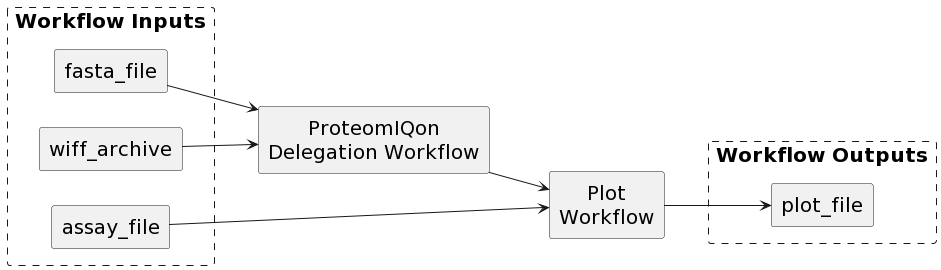
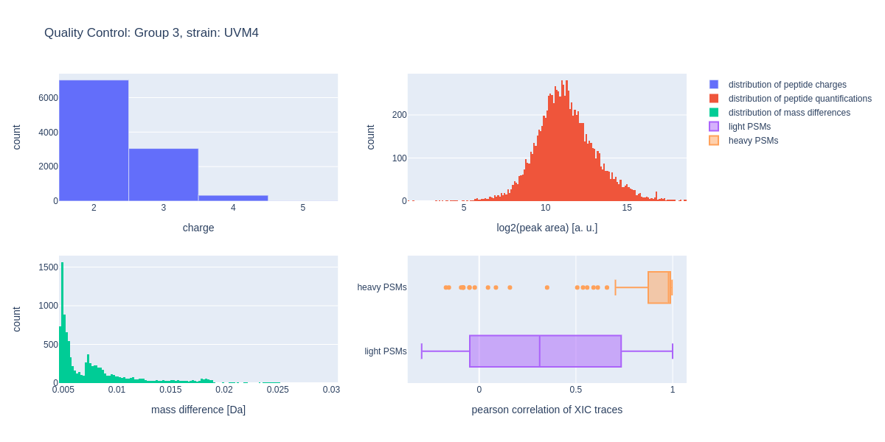

# Mixed Galaxy delegation workflow

This workflow combines a Galaxy delegation workflow with a pure CWL workflow.
The executed Galaxy workflow utilizes [msconvert](https://proteowizard.sourceforge.io/tools.shtml) to convert the wiff archive located in ```data/WCGr3_U2.tar``` to an ```.mzml``` file and subsequently executes a selection of tools from the [ProteomIQon](https://github.com/CSBiology/ProteomIQon) toolset.
After the delegation workflow has finished execution, a pure CWL workflow gets executed that plots the ```.quantAndProt``` file produced by the ProteomIQon tools.


## Execution
In order to execute this workflow, first make sure that you have [Docker](https://www.docker.com/), [Cwltool](https://github.com/common-workflow-language/cwltool) and [git-lfs](https://git-lfs.github.com/) installed on your system. Afterwards, execute the following steps:

1. Create an account and login on https://usegalaxy.eu/
2. Go to https://usegalaxy.eu/user/api_key to obtain your API key
3. Clone this repository and navigate to the directory on your commandline
4. Execute the following command (make sure to insert your API key from step 2): 

```
GALAXY_URL="https://usegalaxy.eu" GALAXY_API_KEY="<YOUR_API_KEY_FROM_STEP_2>" cwltool --preserve-environment GALAXY_URL --preserve-environment GALAXY_API_KEY --outdir ./out workflow.cwl job.yml
```

## Results
The following figure shows the plot produced by the mixed workflow for the ```data/WCGr3_U2.tar``` archive.
